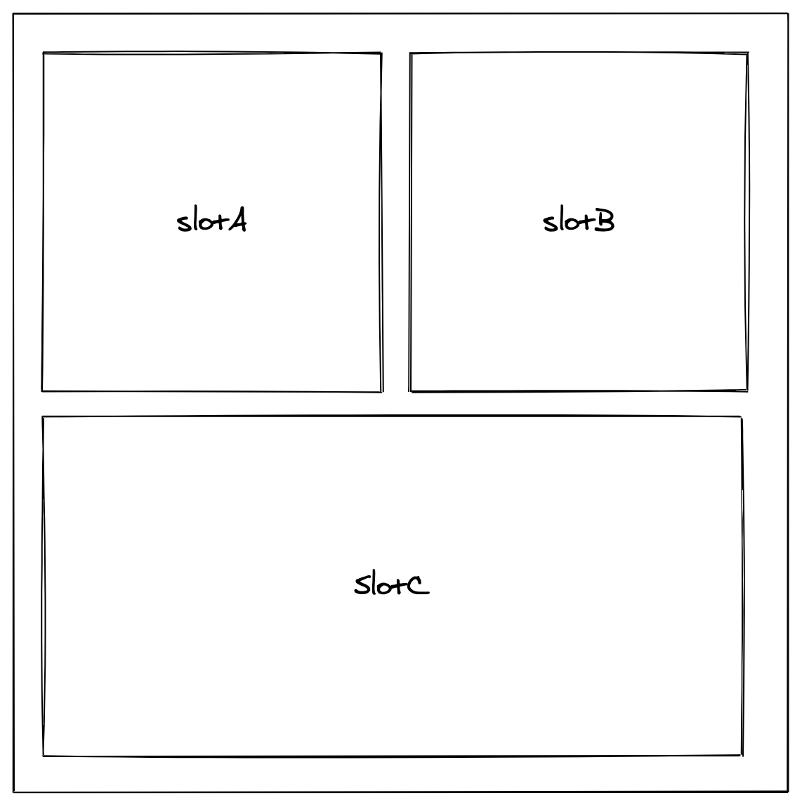

import packageDetails from '../package.json'

<Meta title='buffet-pui/buffet-pui-layouts/GridLayout/readme' />

# buffet-pui-layouts/GridLayout

<>Current version: {packageDetails.version}</>



## Installation

```javascript
yarn add @toasttab/buffet-pui-layouts
```

```javascript
import { GridLayout } from '@toasttab/buffet-pui-layouts'
```